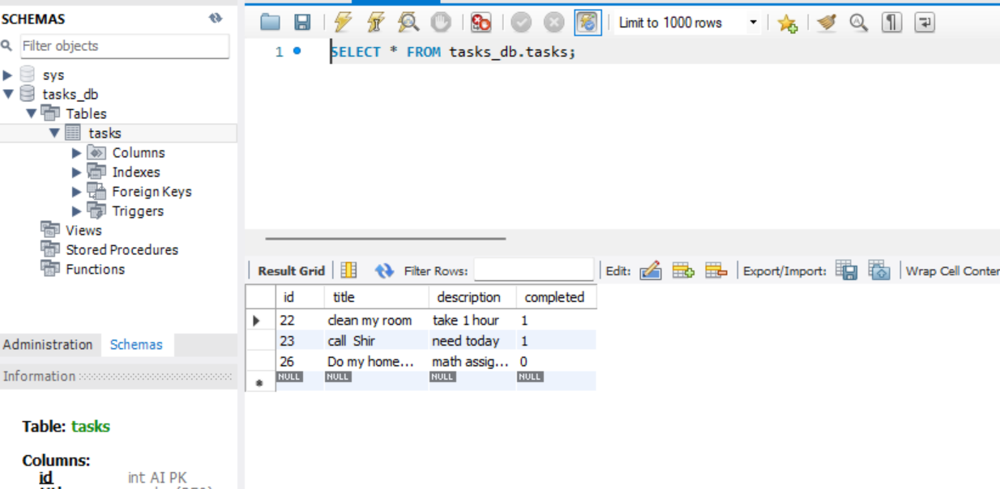
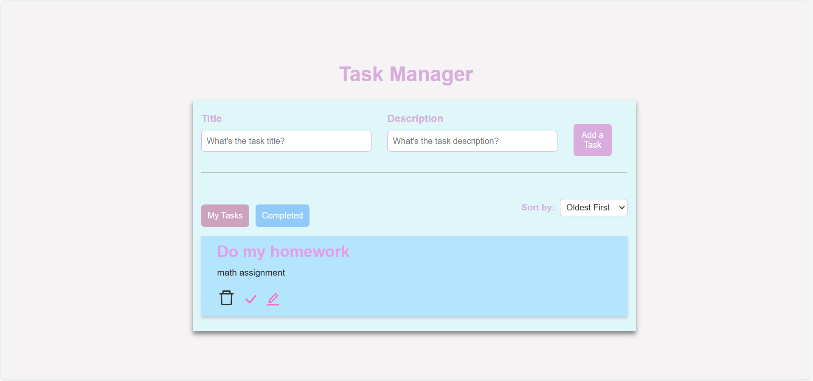
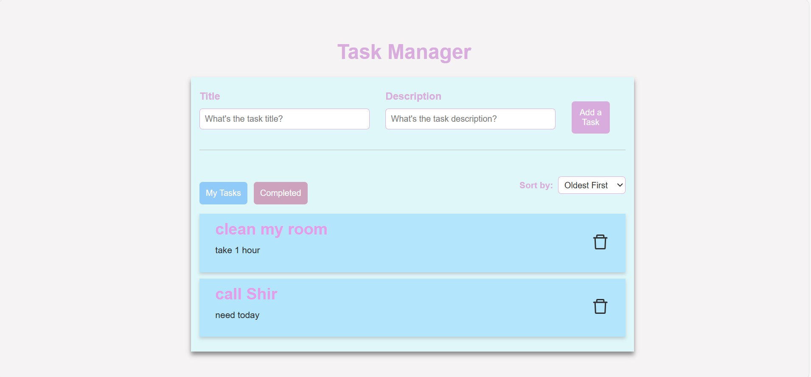

# Task Manager Project

This is a task management application with a FastAPI backend and a React frontend, using MySQL DB.

## Project Structure

- **Backend**: FastAPI-based RESTful API with endpoints for task management.
- **Frontend**: React-based user interface for managing tasks.

## Getting Started

### Prerequisites

- Python 3.8+
- Node.js 14+

### Setup Instructions

#### 1. Clone the repository

```bash
git clone https://github.com/MichalAlhindi/tasks_solution.git
cd tasks_solution
```
#### 2. Set up the Backend
```bash
cd backend
python -m venv venv         # Create virtual environment
venv\Scripts\activate    # Activate virtual environment
python -m pip install --upgrade pip
pip install -r requirements.txt   # Install dependencies
```
- Make sure you have mysql installed, and then rename test.env to .env
- In the .env file: make sure to have your DB configuration correctly and have a DB schema.

Now you can run the backend:
```bash
uvicorn main:app --reload  # Start the FastAPI server
```
The backend should now be running at http://127.0.0.1:8000.
#### 3. Set up the Frontend
```bash
cd frontend
npm install               # Install dependencies
npm start                 # Start the React server
```
The frontend should now be running at http://localhost:3000.

## API Endpoints:
- GET /tasks: Get all tasks
- GET /tasks/{id}: get a specific task
- POST /tasks: Create a new task
- PUT /tasks/{id}: Update a task
- DELETE /tasks/{id}: Delete a task

## DB Schema
I used MySQL 8.0 as my DB. The backend should automatically create a table called 'tasks' in your DB schema.

For example, this how my MySQL Workbench looks like after testing the app:



## How To Use:

### To add a new task: 
Write in a title, a description, and click on 'Add a Task'

Then you will see your tasks listed below.
### To remove, edit, or mark task as completed: 
Click on the icons below the task

### Sorting:
You can sort your task from oldest to newest or otherwise, as you wish. 

### Completed Tasks:
Once you complete a task, it moves automatically to the completed tasks tab:



## Author
Michal Alhindi
